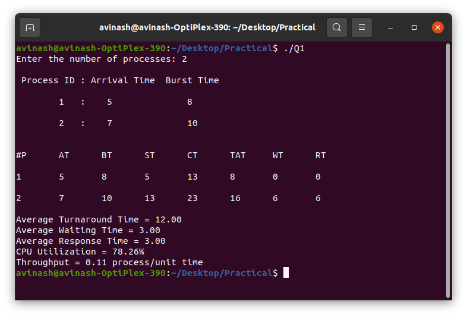
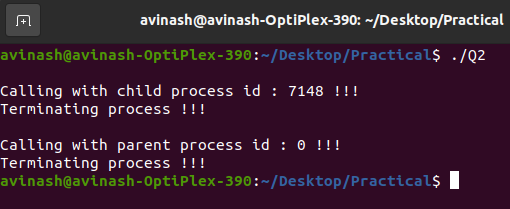

# Operating System Practicals

There are some practical example regarding cpu schedueling & processes.

## Q1 SRTF (Shortest Remaining Time First)

This is the preemptive version of SJF (Shortest Job First) algorithm. It is also called SJRF (Shortest Job Remaining First) algorithm.
Basically SRTF / SJF algorithm can not apply in today's world as we don't know the future that when the process with short burst time arrive.

In this program, i have simulated the SRTF algorithm with sample inputs.

* Output

## Q2 Demonstration of Fork()

In this program, we are demonstrating the fork() function which is used for creating sub / child processes. 

* Output

